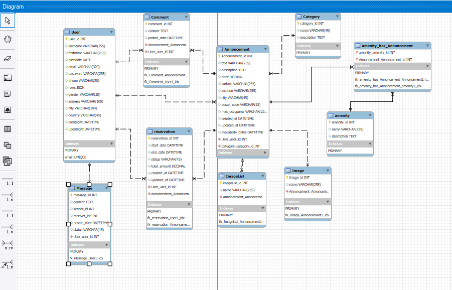

# The Cohort-Project "API Restfull" Symfony CLI

## Table des matières
1. [Introduction](https://github.com/caatwomann69700/Brace-Armchair-API---Symfony-Project/tree/main?tab=readme-ov-file#introduction)
2. [Les Fonctionnalités](https://github.com/caatwomann69700/Brace-Armchair-API---Symfony-Project/tree/main?tab=readme-ov-file#introduction)
3. [Installation](https://github.com/caatwomann69700/Brace-Armchair-API---Symfony-Project/tree/main?tab=readme-ov-file#introduction)
4. [La Création du User](https://github.com/caatwomann69700/Brace-Armchair-API---Symfony-Project/tree/main?tab=readme-ov-file#introduction)
5. [La Création des table](https://github.com/caatwomann69700/Brace-Armchair-API---Symfony-Project/tree/main?tab=readme-ov-file#introduction)
6. [L'Explication des tables et de leurs relations](https://github.com/caatwomann69700/Brace-Armchair-API---Symfony-Project/tree/main?tab=readme-ov-file#introduction)
7. [La Généreration des tables](https://github.com/caatwomann69700/Brace-Armchair-API---Symfony-Project/tree/main?tab=readme-ov-file#introduction)
8. [L'Exécution des tables](https://github.com/caatwomann69700/Brace-Armchair-API---Symfony-Project/tree/main?tab=readme-ov-file#introduction)
9. [Initialiser les Données avec App Fixtures](https://github.com/caatwomann69700/Brace-Armchair-API---Symfony-Project/tree/main?tab=readme-ov-file#introduction)
10. [L'integration de l'API Plateform](https://github.com/caatwomann69700/Brace-Armchair-API---Symfony-Project/tree/main?tab=readme-ov-file#introduction)

## Introduction
Colivio_API est une application back-end que j'ai développée avec le framework Symfony en vesrion 6.4 sans l'utilisation du webapp.
permettant de gérer des annonces, utilisateurs, catégories,commentaires, reservations, images, imageslistes et equipements. 
Je l'ai conçue pour être utilisée comme API RESTful pour ensuite l'integrer dans une application angular coté front-end.
Au sein de cette API, j'ai utiliser API Platform pour la création et la gestion des points de terminaison API, avec une sécurisation via JWT ainsi que les groupes de serialisations. 
## Les Fonctionnalités 
dgdgd
## L'installation 
### Prérequis
+ PHP 8.1 ou plus 
+ Composer 
+ MySQL ou tout autre SGBD compatible 
+ Symfony CLI 
+ OpenSSL pour la gestion des certificats JWT 
### Les étapes d'installation et configuration de la base de données 
1. Creation du projet  
```php
symfony new colivio_API --version=6.4 
```
2. Création d'un fichier .env.local a partir du .env et configuration des informations de la base de donnéess 
```
DATABASE_URL="mysql://root:@127.0.0.1:3306/colivio_Api"
```
3. Creation de la base de données dans le terminal a la racine du projet  : 
```
php bin/console doctrine:database:create
```
4. Installation de Composer  : 
```
composer require orm 
```
5.  Installation du Profiler  :
```
composer require --dev profiler
````
6. Installation du Maker  :
```
composer require --dev maker
````
7. Installation des Fixtures  :
```
composer require --dev orm-fixtures
````
7. Installation du Bundle de security  :
```
composer require security
````
8. Installation du bundle de groupes de serialisations 
````
composer require symfony/serializer-pack
````
9. Installation du bundle des validators  : 
````
composer require symfony/validator
````
## La Création du "User" 
Pour commencer j'ai creer le " User " avec l'identifiant principal email  : 
```
php bin/console make: User
```
 - Pourquoi <b>"make:User"</b> et pas <b>"make:entity User"</b> ? 

dans Symfony est utilisée pour créer une entité User spécialement adaptée pour gérer les utilisateurs dans un contexte d'authentification et de sécurité.
make:user s'assure que l'entité User implémente correctement l'interface UserInterface
Voici pourquoi il est préférable d'utiliser make:user plutôt que make:entity User.
La commande make:user génère automatiquement une entité préconfigurée avec les propriétés et méthodes nécessaires pour l'authentification dans Symfony, comme :
* La propriété email comme identifiant principal.
* La méthode getRoles() pour gérer les rôles (ROLE_USER, ROLE_ADMIN, etc.).
* La méthode getPassword() pour l'utilisation avec les encodeurs de mots de passe.
* La méthode eraseCredentials() pour des raisons de sécurité.

<b> Important !</b>

Pour la proprieté Email j'ai mis une longueur de 320 en (Varchar) car Cette taille est conforme aux spécifications des adresses e-mail (RFC 5321 et RFC 5322)

<b>Une adresse e-mail est composée des éléments suivants :</b>

* <b>La partie locale (avant le @) :</b> Maximum de 64 caractères.

* <b>Le caractère @ :</b> Prend 1 caractère.

* <b>Le domaine (après le @) :</b> Maximum de 255 caractères, selon la même spécification.

<b>
Ce qui fait un total de 320 caractères
</b>

## La Création des tables : 
+ Annoncement 
+ Housing  
+ Category 
+ Image
+ ImageList 
+ Comment
+ Message 
+ Reservation 
+ Amenity 

 La commande pour la creation de chaque table : 
```
php bin/console make:entity 
```
## L'Explication des tables et de leurs relations : 

- <b> Annonce </b>: Gestion des Annonces
L'entité Annonce représente les annonces de coliving avec des propriétés comme le titre, la description, le prix, la surface, et la localisation etc.... Elle gère plusieurs relations avec les tables suivantes : image(pour les cards), category(categorie), amenity(équipement), reservation, et imagelist(pour les pages details d'une annonce).

- <b> Amenity </b>: Gestion des Équipements
L'entité Amenity définit les équipements associés aux annonces (ex. Wi-Fi, piscine). Elle gère une relation ManyToMany avec Annonce, permettant de relier plusieurs équipements à plusieurs annonces.

- <b> Category</b> : Organisation des Catégories
L'entité Category organise les types de logements ou d'annonces, avec une relation OneToMany vers les annonces et une relation OneToOne pour une image principale.

- <b> Image </b> : Image Principale
L'entité Image gère les images principales des annonces ou catégories via des relations OneToOne. Elle contient des propriétés comme le nom et le chemin de l'image.

- <b> ImageList </b> : Liste d'Images
L'entité ImageList permet d'ajouter plusieurs images à une seule annonce via une relation ManyToOne. Elle est utilisée pour enrichir visuellement les annonces.

- <b> Reservation </b>: Gestion des Réservations
L'entité Reservation stocke les informations liées aux réservations, comme les dates de début et de fin, le statut et le montant total. Elle a une relation ManyToOne avec les annonces.


## La généreration des tables dans notre base de données  
```
php bin/console make:migration 
```
 - Générer une migration après la création ou la modification d'tables est une étape essentielle pour garantir que la structure logique des données dans notre application Symfony soit correctement synchronisée avec la base de données.

## L'Exécution des tables  : 
```
php bin/console doctrine:migrations:migrate
```
- Une fois les migrations générées avec la commande php bin/console make:migration, elles doivent être exécutées pour appliquer les modifications à la base de données. La commande php bin/console doctrine:migrations:migrate réalise cette étape.

## Initialiser les Données avec App Fixtures
L'étape d'instanciation des fixtures consiste à peupler la base de données avec des données factices ou initiales  : 
````
php bin/console doctrine:fixtures:load
````
## L'integration de l'API Plateform :
Pour intégrer API Platform dans notre application Symfony, on commence par installer le bundle  :
````
composer require api
````
## Configuration des tables pour l’API 
Pour que nos tables soient exposées via API Platform, on doit ajouter les annotations nécessaires.
### L'importation des Annotations
 Voici ce qu'il faut importer et configurer dans nos tables :
 ````php
use ApiPlatform\Metadata\ApiResource;

use Symfony\Component\Serializer\Annotation\Groups;
````
### Exposition les tables comme Ressources API
On Ajoute l'annotation #[ApiResource] à chaque entité qu'on souhaite exposer
````php 
#[ApiResource(
    normalizationContext: ['groups' => ['entity:read']],
    denormalizationContext: ['groups' => ['entity:write']]
)]
````
### Configuration des Groupes de Sérialisation 
On Utilise les annotations #[Groups] pour spécifier les propriétés accessibles en lecture ou écriture via l'API. 
````php 
#[Groups(['entity:read', 'entity:write'])]
private string $name;
````